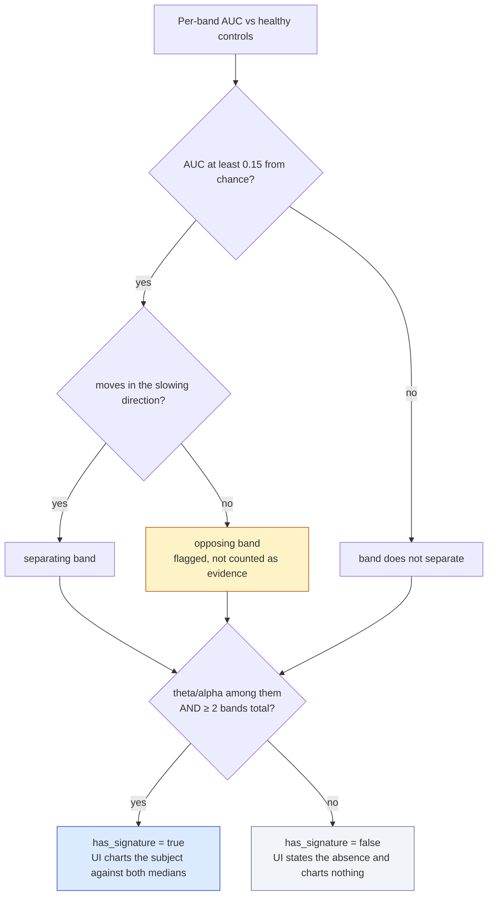

# EEG pattern evidence: what holds, what does not, and how to fix it

**Run** `20260820T114437Z` · Lightweight EEG Transformer, raw `[1, 128, 1024]` input
**Cohort** BrainLat, 115 subjects — HC 32 · AD 35 · PD 26 · MS 22
**Written** 2026-08-21, after adding the band-pattern and scalp-topography panels

Building the "point at the EEG pattern" feature forced a question the AUC table never
asks: *can the model's discrimination be reproduced by anything a neurophysiologist
would recognise?* For AD and PD, mostly yes. For MS, no — and the reason is
measurable, not speculative. This document records what each condition lacks and what
would actually fix it.

---

## 1. The measurement

Relative band power per subject, compared against healthy controls with a rank-based
AUC (Mann-Whitney U normalised to [0, 1]). 0.50 is chance. A band is treated as
separating when it clears 0.15 either side of chance.

| Band | AD (n=35) | PD (n=26) | MS (n=22) |
|---|---:|---:|---:|
| delta | 0.59 | **0.77** | **0.29** ⚠ |
| theta | **0.73** | **0.81** | 0.53 |
| alpha | 0.39 | **0.24** | 0.62 |
| beta | **0.34** | **0.31** | 0.50 |
| low gamma | 0.56 | 0.51 | 0.46 |
| **theta / alpha** | **0.72** | **0.84** | **0.48** |
| | | | |
| **Encoder AUC** | 0.967 | 0.988 | **0.992** |

Read the last two rows together. PD and AD show coherent slowing — more theta and
delta, less alpha and beta — and the encoder's advantage over the simple marker is
modest. MS sits at chance on every canonical axis while the encoder separates it
better than either. **Whatever the MS head is reading, it is not EEG slowing.**

⚠ marks a band that separates in the *wrong* direction: MS subjects show *less*
delta than controls, which is what a younger brain looks like, not an affected one.

### The gate this produced

Implemented in [`eeg_band_statistics.py`](R26-DS-015/backend/app/services/eeg_band_statistics.py),
served at `GET /eeg/band-reference`, enforced by
[`test_eeg_band_statistics.py`](R26-DS-015/backend/tests/test_eeg_band_statistics.py).
MS currently lands in the right-hand branch and the UI says so in words.

---

## 2. MS — four separate deficiencies

### 2.1 The age confound is total, not partial

Ages recovered for 87 of 115 subjects:

| Class | n with age | Median | Range |
|---|---:|---:|---|
| HC | 32 | 72 | 56 – 83 |
| AD | 35 | 76 | 64 – 98 |
| MS | 20 | **39** | **22 – 55** |
| PD | 0 | — | — |

MS tops out at 55. Every other subject starts at 56. There is **no overlap at all**:

> The rule `age < 56 → MS` classifies **87 / 87 = 100%** of age-recoverable subjects
> correctly.

A single scalar threshold outperforms nothing — it *ties* the encoder's 0.992 while
using no EEG whatsoever. Any MS-vs-rest result on this cohort is therefore
unfalsifiable: age and diagnosis are the same variable.

The existing within-negatives correlation (MS r = −0.15) shows the head is not a
*general* age detector, which is a real and worthwhile finding. It does not show that
MS discrimination is age-independent, because within the negatives there are no young
subjects to discriminate.

**How to resolve — in order of strength**

1. **Age-matched subsample.** Recruit or borrow HC subjects aged 22–55. Even 12–15
   young controls turns an impossible comparison into a testable one. This is the
   only fix that makes the current claim verifiable rather than merely hedged.
2. **Age-stratified evaluation.** Report MS AUC within a restricted age window. With
   the present data the window is empty, which is itself the honest headline result.
3. **Adversarial de-biasing.** Add a gradient-reversal age-regression head on `z_eeg`
   during training and report the trade-off curve between MS AUC and age-probe MAE. A
   drop in MS AUC as age becomes unpredictable *quantifies* the confound; no drop
   would be the strongest possible defence. Cheap to run, and it converts a caveat
   into a measurement.
4. **Do not** rely on post-hoc regression of age out of the score. With zero overlap
   the regression is extrapolating, not adjusting.

### 2.2 Site is perfectly collinear with class

All 22 MS subjects were recorded at AR; PD is 21/26 at CL. The site probe reaches
62.1% balanced accuracy against a 53.9% majority baseline — modest on its own, but for
MS specifically site is a *perfect* predictor, exactly as age is.

**How to resolve.** MS recordings from a second site, or leave-one-site-out
evaluation for the conditions that have both (AD is 16 AR / 19 CL and can support it
today — worth running as a positive control that the pipeline is not simply reading
amplifier characteristics).

### 2.3 The model reads one electrode bank

Occlusion on the MS demo subject `MS-AR-suj_519`:

| Region | Bank | Importance |
|---|---|---:|
| Right lateral | B | **+0.361** |
| Posterior | A | +0.000 |
| Left lateral | C | +0.000 |
| Frontal-central | D | +0.000 |

Zeroing three of the four banks changes the MS score by less than 0.001. Compare the
AD demo subject, where posterior (+0.884) and right lateral (+0.599) both contribute.

A physiologically meaningful MS finding would be expected to show *some* bilaterality;
a single-bank dependence with nothing elsewhere is the profile of a localised
artefact or a site-specific channel characteristic.

**How to resolve.** Occlude at finer granularity — individual electrodes within bank
B, and B split into anterior/posterior halves — to see whether the dependence
localises to a handful of channels. If it collapses onto 2–3 electrodes, that is a
hardware or reference artefact, not a neurological pattern. This is a small change to
`_occlusion()` in `eeg_inference_service.py` and needs no retraining.

### 2.4 Small n makes the interval, not the point estimate, the result

22 MS subjects, of which the reported AUC 0.992 carries a bootstrap CI of [0.98, 1.00].
With one site and one age band, the effective sample size for the question "does EEG
distinguish MS" is closer to 1 than to 22.

**How to resolve.** Report n alongside every MS figure — already done in the UI
legend — and avoid any per-subject MS claim in the dissertation's conclusions section
that is not explicitly conditioned on the confound.

---

## 3. AD — what is missing

The AD signature is **real but thin**: 3 of 6 bands separate (theta 0.73, theta/alpha
0.72, beta 0.34).

- **Alpha misses the gate at 0.39.** It is on the correct side (AD has less alpha) and
  0.11 from chance, but below the 0.15 margin. Alpha reduction is the single
  best-documented AD marker in the literature, so its weakness here is worth
  explaining rather than ignoring. Most likely causes: resting-state eyes-open vs
  eyes-closed protocol differences across sites, or alpha-band ICA components being
  removed as artefacts.
- **Delta at 0.59 is uninformative,** where the literature would expect elevation.

**How to resolve.** Check the eyes-open/eyes-closed condition per recording in the
BrainLat metadata and stratify — alpha reactivity is the largest single source of
alpha-band variance and would plausibly recover the marker. Second, log which
frequency bands the rejected ICA components occupied; the pipeline already records
per-component `hf_power_ratio` and kurtosis, so adding band occupancy is a few lines
in `eeg_preprocessing.py`.

AD ages (median 76) sit close to HC (72) with wide overlap, so unlike MS the AD
comparison is age-supportable. This is the one condition where the current cohort can
carry the claim.

---

## 4. PD — strongest signal, weakest provenance

PD shows the clearest slowing profile in the cohort: 5 of 6 bands separate, theta/alpha
at 0.84. But:

- **PD age is entirely unrecoverable.** The demographics CSV in the dataset is an HTML
  error page, so `age` is null for all 26 PD subjects. PD is the only condition whose
  score cannot be age-assessed at all, and `pearson_r_within_negatives` for PD (−0.24)
  is computed over the *other* classes' ages, not PD's own.
- **PD is 21/26 at site CL,** the mirror image of the MS/AR imbalance.
- **PD recordings are pre-epoched** and reassembled with a tapered join; the other
  classes are continuous. Source kind is a per-class artefact, and the encoder could
  in principle read the join.

**How to resolve.**

1. Re-download the PD demographics file from Synapse — this is a broken download, not
   missing data, and fixing it is the single highest-value action in this list.
   `dataset/download_synapse_eeg.py --verify-only` will identify it.
2. Once ages exist, rerun `finalize_eeg_model.py`; the age-correlation table
   populates for PD automatically.
3. Test the join hypothesis directly: score PD subjects with the taper replaced by a
   hard butt join and by a longer ramp. If the score moves materially, the encoder is
   reading the seam.

---

## 5. Gaps that affect all three

| Gap | Evidence | Resolution |
|---|---|---|
| Occlusion exists for **4 of 115** subjects | training run exported deep reports for demo subjects only | rerun the export loop over all subjects; ~115 × 4 forward passes, minutes on CPU |
| `band_importance` is **empty everywhere** | the model takes raw `[1, 128, 1024]`; there are no band planes to occlude | either retrain on the hybrid STFT+CWT tensor `[10, 128, 16]`, or add a band-stop occlusion that filters each band out of the raw signal before re-scoring |
| Serving pinned to `legacy_eps` | model trained under `x/(std+1e-6)`; exact z-scoring moves a held-out control from PD 0.026 to **PD 0.848** | retrain on the corrected notebooks, which stamp `zscore_exact` into the bundle |
| **15 `.fdt` files missing** from the dataset | incomplete Synapse download | rerun `download_synapse_eeg.py`; recovers subjects currently excluded |
| 2 subjects fail preprocessing | `PD-AR-sub-40010` 0/192 clean epochs; `MS-AR-suj_512` 5/228 | interpolate the detached electrodes upstream (B5 at 1,348 µV on the first) |
| Projection covers 4 of 115 | full `z_eeg` vectors exported for demo subjects only | same export loop as the occlusion gap |

---

## 6. Priority

| # | Action | Cost | What it buys |
|---|---|---|---|
| 1 | Re-download PD demographics + the 15 `.fdt` files | minutes | PD becomes age-assessable; recovers excluded subjects |
| 2 | Export occlusion + embeddings for all 115 subjects | ~1 hour | the two panels work cohort-wide instead of for 4 subjects |
| 3 | Fine-grained occlusion within bank B for MS | ~1 hour | decides whether the MS signal is artefactual |
| 4 | Age-matched young control subgroup | recruitment | the only real fix for the MS confound |
| 5 | Adversarial age head + trade-off curve | ~1 day | quantifies the confound instead of disclosing it |
| 6 | Retrain with `zscore_exact` on the corrected notebooks | ~1 day | removes the train/serve epsilon pin |

Items 1–3 need no retraining and no new data.

---

## 7. What this feature deliberately does not do

- **No MS pattern is displayed.** The panel states the absence and charts nothing.
  This is enforced by `has_signature` in the API and asserted by two tests; a future
  run that reports a signature for all three conditions raises a warning in
  `verify_eeg_bundle.py`.
- **Band power is labelled descriptive, never causal.** The encoder consumes raw
  time-domain epochs and never sees a spectrum, so "your recording resembles the AD
  group's" is supportable and "this drove your score" is not. Only the occlusion
  topography carries a causal claim.
- **The scalp diagram shows four sectors, not an interpolated topomap.** Occlusion was
  run on whole BioSemi banks, so four aggregates is the entire spatial resolution that
  was measured. Smoothing them into a continuous scalp map would draw detail that was
  never computed.

---

## 8. The honest summary for the dissertation

Of the three conditions this encoder scores, **one (AD) is supported by the cohort,
one (PD) is supported in signal but not in provenance, and one (MS) is confounded
beyond rescue with the data as it stands.** The 0.992 MS AUC is best reported as an
upper bound that a single age threshold also achieves, not as evidence that resting
EEG distinguishes multiple sclerosis.

That is a stronger result than three high AUCs presented without this analysis — it
demonstrates the evaluation was capable of failing.
