# EEG Risk Module — Frontend/Backend Integration Plan

**R26-DS-015 · NeuroRisk Research Platform**
Adding the `z_eeg` neurological risk encoder alongside the existing speech pipeline.

---

## Implementation status — all six phases built, real model installed

| Phase | Status | Verification |
|---|---|---|
| 1 · Artifacts | **Done** | `finalize_eeg_model.py`, `build_eeg_cohort_index.py`, `verify_eeg_bundle.py` |
| 2 · Backend read-only | **Done** | 6 endpoints; 67 backend tests pass |
| 3 · Frontend Tier 1 | **Done** | 4 routes; typecheck + lint + build clean; driven in a browser on 115 real subjects |
| 4 · History integration | **Done** | Predicted breakage hit exactly 3 files; all fixed |
| 5 · Backend Tier 2 | **Done** | Real upload over HTTP in 8.3 s; matches the training run |
| 6 · Frontend Tier 2 | **Done** | Upload UI + job polling; degrades to 503 notice when inference is off |

**Installed model:** run `20260820T114437Z` — Lightweight EEG Transformer on the raw
`[1, 128, 1024]` tensor, 115 BrainLat subjects, pooled AUC AD 0.967 / PD 0.988 / MS 0.992.
Both ablations went against expectation: the Transformer beat EEGNet and BiLSTM, and the raw
tensor beat the hybrid STFT+CWT one (0.988 vs 0.968), though the encoder margins sit inside the
fold spread.

**Tier 1 needs no PyTorch.** `eeg_cohort_service` imports nothing heavier than pydantic, and
`/eeg/model-card` reports `inference_available: false` rather than failing.

### Two findings from installing the real model

**The age probe never ran.** The notebook's demographics merge produced an empty `age` column, so
`confound_probes.json` records `age: {n: 0}` — the dominant confound on this cohort went
unmeasured. `finalize_eeg_model.py` recovers ages afterwards (87/115) and correlates each delivered
risk score against them. Within non-cases the correlations are weak (AD +0.10, MS −0.15), which is
the evidence the heads are not age detectors, and why MS is graded `HIGH (site)` rather than
`CRITICAL (age + site)`. PD demographics are unrecoverable, so PD cannot be age-assessed.

**Standardization is versioned, because serving must match training bug-for-bug.** The epsilon fix
made during Phase 5 was applied *after* this model was trained, creating a silent train/serve skew:
a held-out healthy control moved from PD 0.026 to **PD 0.848**. The bundle now declares which
z-score variant the model was fitted under (`legacy_eps` here, `zscore_exact` for anything trained
on the corrected notebooks), and `check_serving_parity.py` proves serving reproduces the run —
worst deviation 0.025 across eight subjects spanning all four classes.

---

## 0. Executive summary

The platform today is a **speech-only** system: audio or 14 hand-entered acoustic features go in, a
4-class softmax comes out, and the UI renders a probability distribution. The EEG module produces
something structurally different — **three independent risk scores that do not sum to 1**, a 256-D
`z_eeg` embedding, and a mandatory confound disclosure.

The central design decision in this plan: **do not force EEG output through the existing
`Prediction` contract.** `ProbabilityBars` renders a distribution; feeding it independent sigmoids
would draw a chart that is quietly wrong. EEG gets its own schema, its own service layer and its own
visual language, sharing the app shell, error taxonomy and history store.

Second decision: **inference is asynchronous.** EEG preprocessing costs 30–90 s per subject (FastICA on
128 channels dominates), against ~2 s for the speech path. A synchronous `POST` would sit past every
default proxy timeout. Upload returns `202 + job_id`; the client polls.

Third decision, and the one that makes this *showcase-able*: **two tiers.** The notebook already emits a
complete deep-schema JSON report for all ~118 cohort subjects. Serving those as a browsable cohort gives
an instant, zero-inference demonstration of the full output. Upload-your-own is the second tier.

| | Existing speech path | New EEG path |
|---|---|---|
| Input | Audio ≤18 MB, or 14 floats | `.set` + `.fdt` ≈ 90 MB, or a cohort subject id |
| Output | 1 class + softmax over 4 | **3 independent sigmoid risk scores** + `z_eeg[256]` |
| Latency | ~2 s | 30–90 s (async job) or instant (precomputed) |
| Runtime | TensorFlow / scikit-learn | **PyTorch TorchScript** |
| Disclosure | Static disclaimer string | **Per-class confound severity + probe metrics** |

---

## 1. Current system — what actually exists

Read from source, not assumed.

### 1.1 Backend structure

```
backend/
├── app/
│   ├── main.py                    FastAPI app, CORS, request-ID + timing middleware
│   ├── api/
│   │   ├── router.py              mounts /health, /predictions, /voice-assessments
│   │   └── routes/
│   │       ├── health.py
│   │       ├── prediction.py                  POST /predictions/
│   │       ├── voice_assessment.py            POST /voice-assessments/
│   │       └── neurological_prediction.py     POST /neurological-risk/predict
│   ├── core/
│   │   ├── config.py              Settings: model_dir, gemini keys, CORS origins, disclaimer
│   │   ├── exceptions.py          AppError → ModelLoadError | FeatureValidationError
│   │   │                                    | PredictionError | AudioFeatureExtractionError
│   │   └── logging.py
│   ├── models/                    ← model artifacts live here
│   │   ├── speech_neuro_risk_classifier.keras
│   │   ├── feature_scaler.joblib · label_encoder.joblib · feature_columns.joblib
│   │   ├── neurological_risk_model.joblib
│   │   └── neurological_risk_runtime_model.joblib
│   ├── schemas/                   pydantic request/response models
│   ├── services/
│   │   ├── model_loader.py        @lru_cache(1) → ModelAssets(model, scaler, encoder, columns)
│   │   ├── prediction_service.py  validate → scale → keras predict → normalize → risk
│   │   ├── neurological_prediction_service.py   sklearn pipeline path
│   │   ├── gemini_audio_service.py             audio → structured features
│   │   ├── risk_service.py        risk score + level from class & confidence
│   │   └── recommendation_service.py
│   └── utils/feature_validator.py exact-schema validation + API→model name aliasing
└── scripts/build_neurological_runtime_model.py   notebook → servable artifact
```

**Patterns worth preserving** — the EEG module should look like it was written by the same hand:

- Route is thin: call service, translate `AppError` subclasses to HTTP codes, log, return.
- Service owns all logic; loaders are `@lru_cache(maxsize=1)`.
- Every model output is defensively normalised (`_normalize_probabilities` checks finite, non-negative,
  non-zero-sum) before it reaches a schema.
- Requests carry `X-Request-ID`; middleware logs method, path, status, duration.

### 1.2 Frontend structure

Next.js **16.3.1**, React **19.2.8**, Tailwind **4**, App Router. Every page is `"use client"`.

```
frontend/
├── app/
│   ├── page.tsx               Overview — two assessment entry cards
│   ├── voice/{page,results}   record/upload → POST → results
│   ├── general/{page,results} 14-feature form → POST → results
│   ├── history/page.tsx       localStorage table, filter + re-view + JSON download
│   ├── insights/page.tsx      aggregate dashboard over local history
│   └── settings, support
├── components/
│   ├── app-shell.tsx          sidebar nav + header ("Models Online" pill)
│   ├── results-view.tsx       shared by voice + general results
│   ├── probability-bars.tsx   renders a softmax distribution
│   ├── page-header.tsx · research-disclaimer.tsx
│   └── ui/{button,card,input}.tsx
└── lib/
    ├── api.ts                 fetch wrappers, NEXT_PUBLIC_API_BASE_URL
    ├── types.ts               SpeechFeatures · Prediction · VoiceAssessment · HistoryItem
    ├── history.ts             localStorage + sessionStorage via useSyncExternalStore
    └── utils.ts               cn() · percent()
```

### 1.3 Current architecture

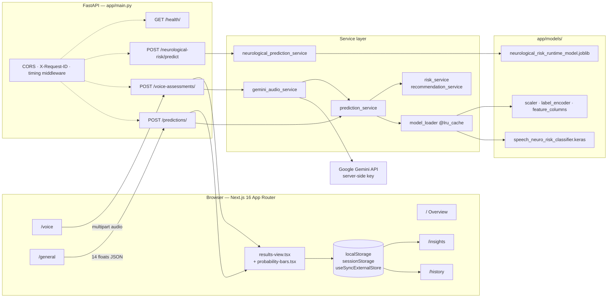

### 1.4 Current request flow — voice assessment

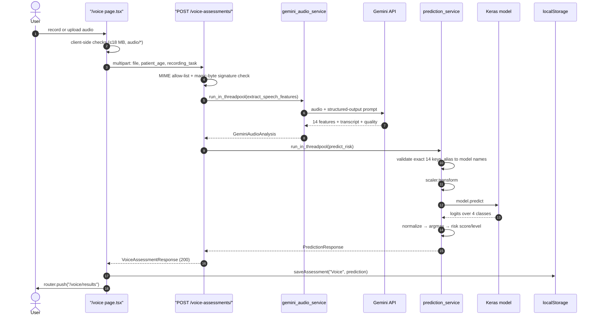

---

## 2. Why EEG does not fit the existing contracts

Four concrete mismatches. Each one drives a design decision later.

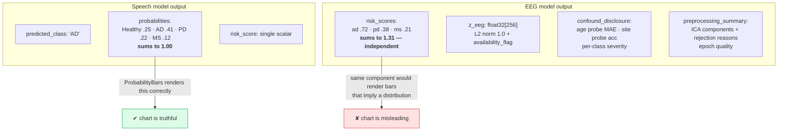

| # | Mismatch | Consequence |
|---|---|---|
| **M1** | Risk scores are **independent sigmoids**, not a softmax | `Prediction.probabilities` and `ProbabilityBars` cannot be reused. A subject may legitimately score high on two conditions; a distribution chart cannot express that |
| **M2** | `risk_service.calculate_risk_score()` assumes one `predicted_class` and a `"Healthy"` sentinel | No single "predicted class" exists. Needs per-condition banding instead |
| **M3** | Inference is **30–90 s**, not ~2 s; input is **~90 MB**, not ≤18 MB | Synchronous request + 18 MB cap both break |
| **M4** | Output carries a **mandatory confound disclosure** | The static `settings.disclaimer` string is not enough — severity is per-condition and must reach the screen |

**M4 is the one with ethical weight.** The model card states that MS subjects in the training cohort are
~33 years younger than every other group and come from a single site, so the MS risk score is partly an
age detector. If that ships as a bare number in a clinical-looking UI, the interface is lying by
omission. The plan treats the disclosure as a **render-blocking requirement**, not a footnote.

---

## 3. Target architecture

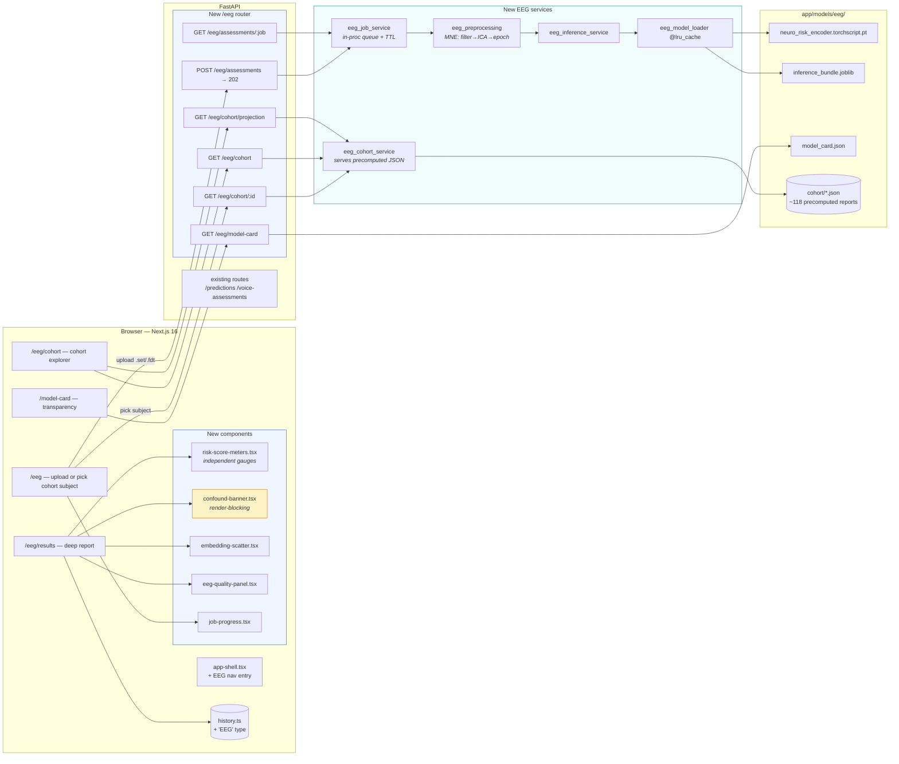

### 3.1 Where the model artifacts come from

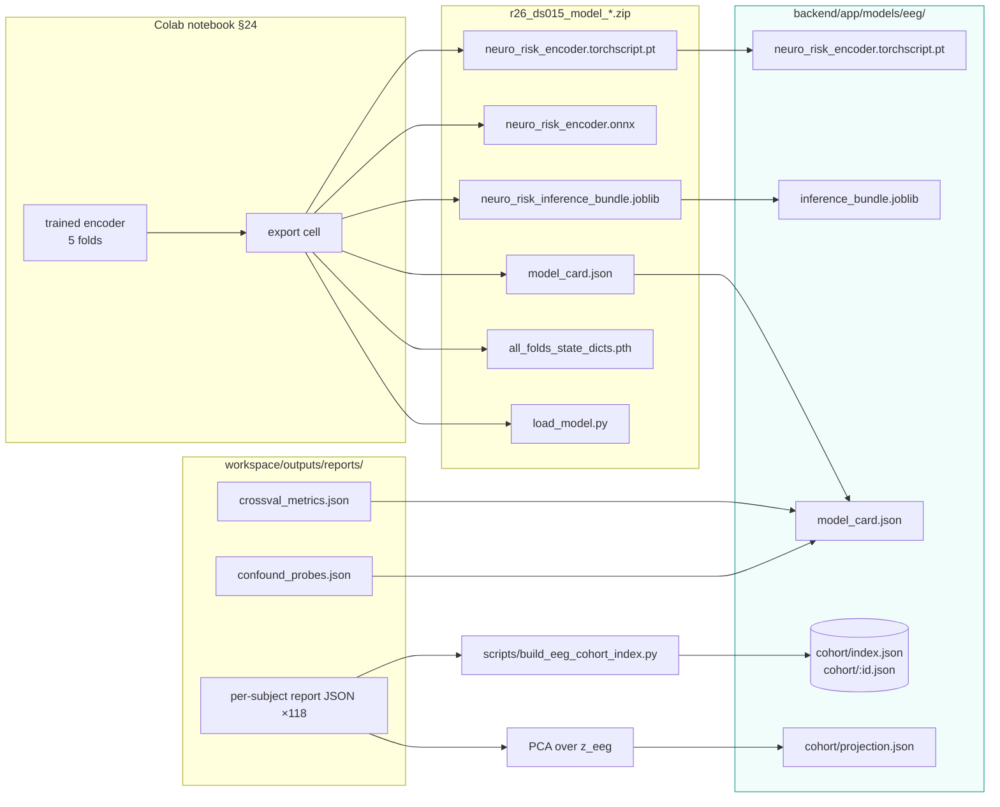

**TorchScript is the artifact the backend loads.** `torch.jit.load()` needs no notebook code — no
`NeuroRiskEncoder` class, no `ExtendedEEGNet`, nothing to keep in sync. The `.pth` state_dicts stay in
the bundle for retraining but are never imported by the API. ONNX is available if the service is ever
split out to a non-Python runtime.

---

## 4. The showcase strategy — two tiers

This is what makes the module demonstrable rather than merely deployed.

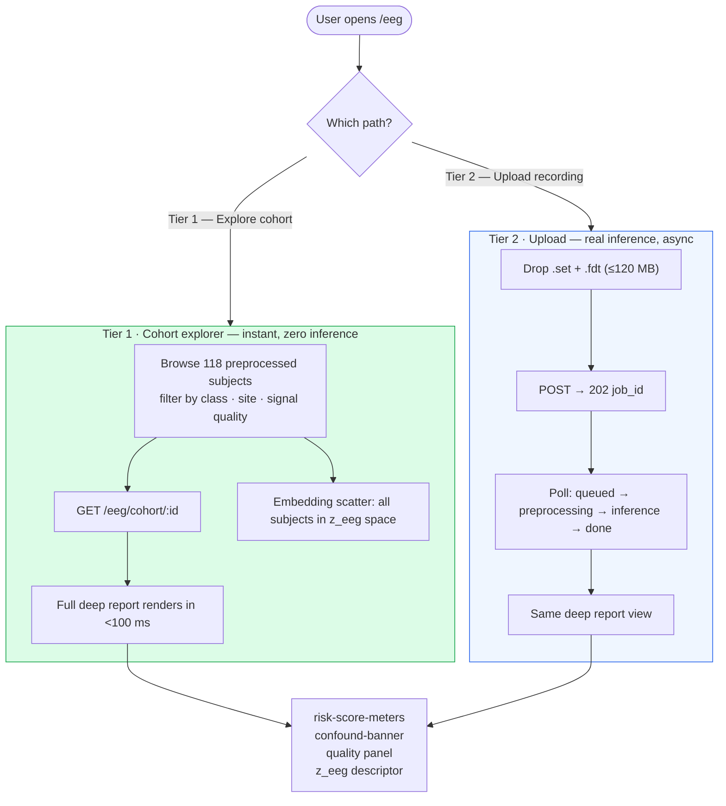

**Why Tier 1 is the primary showcase.** The notebook already writes a complete deep-schema report per
subject — preprocessing stages with per-ICA-component rejection reasons, band-power profile, risk
scores, epoch agreement, `z_eeg` descriptor, occlusion explainability, confound disclosure. Serving
those files needs **no PyTorch in the request path, no ICA, no upload**, and demonstrates every field
the schema defines. It turns a 90-second pipeline into an instant, browsable artifact.

Tier 2 proves the pipeline runs end to end on new data. It is the harder path and the less
demonstration-friendly one, which is exactly why it should not gate the demo.

---

## 5. Backend design

### 5.1 New files

```
backend/
├── app/
│   ├── api/routes/eeg_assessment.py        6 endpoints
│   ├── schemas/eeg_assessment.py           EegRiskReport + job schemas
│   ├── services/
│   │   ├── eeg_model_loader.py             @lru_cache TorchScript + bundle + card
│   │   ├── eeg_cohort_service.py           precomputed report lookup (Tier 1)
│   │   ├── eeg_preprocessing.py            MNE: pick → filter → resample → ICA → epoch
│   │   ├── eeg_inference_service.py        epochs → risk scores + z_eeg
│   │   └── eeg_job_service.py              job registry, TTL, background execution
│   ├── core/exceptions.py                  += EegIngestError, EegQualityError, JobNotFound
│   └── models/eeg/                         artifacts (§3.1)
└── scripts/
    ├── build_eeg_cohort_index.py           reports → cohort/index.json + per-subject
    └── verify_eeg_bundle.py                startup-style contract check
```

### 5.2 Endpoints

| Method | Path | Purpose | Latency |
|---|---|---|---|
| `GET` | `/eeg/model-card` | Architecture, CV metrics, confound probes, intended use | instant |
| `GET` | `/eeg/cohort` | Paged subject list + filters (`class`, `site`, `quality`) | instant |
| `GET` | `/eeg/cohort/{subject_id}` | Full deep report | instant |
| `GET` | `/eeg/cohort/projection` | 2-D PCA coords + labels for the scatter | instant |
| `POST` | `/eeg/assessments` | Upload `.set`(+`.fdt`) → `202 {job_id}` | ~1 s |
| `GET` | `/eeg/assessments/{job_id}` | Job status, progress, result when done | instant |

### 5.3 Async job lifecycle

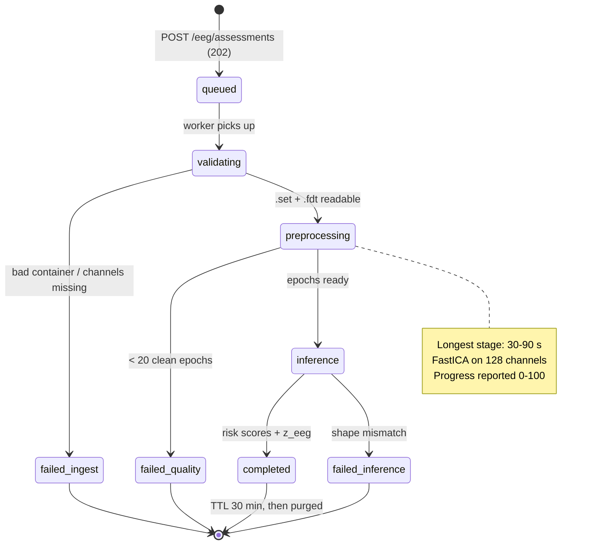

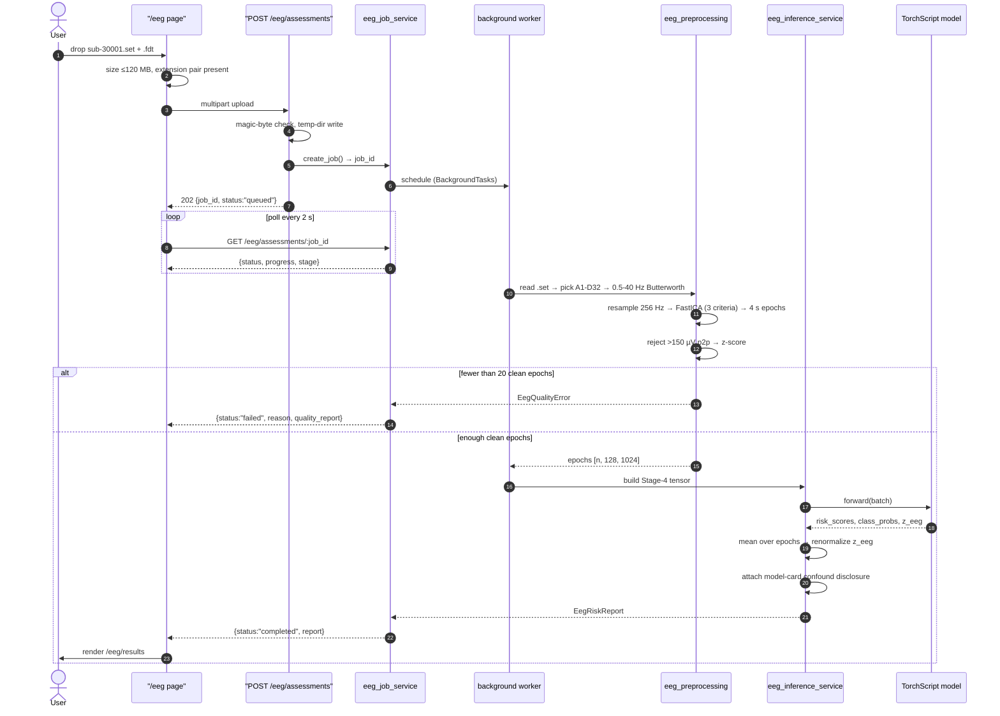

### 5.4 Response schema

Mirrors the notebook's deep schema, trimmed to what a UI can use. `z_eeg` is summarised by default —
256 floats per response is wasteful for rendering, and the full vector is a separate call.

```jsonc
{
  "subject_id": "AD-AR-sub-30001",
  "source": "cohort",                       // "cohort" | "upload"
  "generated_at": "2026-08-20T04:11:07Z",

  "risk_scores": {                          // ← PRIMARY. Independent sigmoids.
    "ad_risk_score": 0.7213,
    "pd_risk_score": 0.3844,
    "ms_risk_score": 0.2107
  },
  "risk_assessment": {
    "conditions": {
      "AD": { "risk_score": 0.7213, "risk_band": "High",
              "label": "AD-related EEG risk pattern",
              "epoch_score_std": 0.041, "confound_severity": "MODERATE (age)" },
      "PD": { "risk_score": 0.3844, "risk_band": "Low",  "confound_severity": "low" },
      "MS": { "risk_score": 0.2107, "risk_band": "Low",  "confound_severity": "CRITICAL (age + site)" }
    },
    "highest_risk_condition": "AD",
    "scores_are_independent": true,
    "interpretation": "Each score is an independent probability … not mutually exclusive."
  },

  "optional_four_class_prediction": {        // auxiliary head — safe for ProbabilityBars
    "predicted_class": "AD",
    "class_probabilities": { "HC": 0.19, "AD": 0.52, "PD": 0.21, "MS": 0.08 }
  },

  "signal_quality": {
    "epochs_used": 80, "clean_epoch_ratio": 0.97, "grade": "Good",
    "ica_components_removed": 4,
    "ica_rejections": [ { "component": 0, "criteria": ["frontal_bipolar"], "score": 0.76 } ],
    "channels": 128, "sampling_rate_hz": 256, "source_kind": "continuous"
  },

  "band_power_profile": {
    "delta": 0.19, "theta": 0.31, "alpha": 0.24, "beta": 0.20, "low_gamma": 0.05,
    "theta_alpha_ratio": 1.27
  },

  "embedding": {                             // fusion contract, summarised
    "dim": 256, "l2_norm": 1.0, "availability_flag": 1,
    "consistency": 0.87,
    "cosine_to_class_centroids": { "HC": 0.31, "AD": 0.74, "PD": 0.44, "MS": 0.28 },
    "nearest_centroid": "AD",
    "vector_url": "/eeg/embeddings/AD-AR-sub-30001"
  },

  "explainability": {
    "scalp_region_importance": { "frontal_central": 0.11, "posterior": 0.07,
                                 "left_lateral": 0.03, "right_lateral": 0.02 },
    "band_importance": { "theta": 0.09, "alpha": 0.06, "delta": 0.02 },
    "method": "occlusion — drop in predicted-condition probability when zeroed"
  },

  "confound_disclosure": {                   // ← render-blocking. See §6.3
    "age_probe_mae_years": 6.05,
    "age_probe_improvement_over_baseline": 0.56,
    "site_probe_balanced_accuracy": 0.50,
    "risk_score_age_correlation": { "AD": 0.37, "PD": 0.55, "MS": -0.18 },
    "severity_by_condition": { "AD": "MODERATE (age)", "PD": "low",
                               "MS": "CRITICAL (age + site)" },
    "statement": "This model was trained on a cohort in which MS subjects are ~33 years younger …"
  },

  "clinical_disclaimer": "Research decision-support indicator. Not a clinical diagnosis …"
}
```

### 5.5 Dependency and process concerns

**PyTorch next to TensorFlow in one process.** `requirements.txt` already pulls TensorFlow; adding
`torch` puts two large numeric runtimes in the same interpreter. CPU-only wheels keep this tractable:

```
torch --index-url https://download.pytorch.org/whl/cpu   # ~200 MB, not the ~2.5 GB CUDA build
mne>=1.6
```

TorchScript inference on ~80 epochs of `[10, 128, 16]` is well under a second on CPU; the GPU buys
nothing at this batch size. **Recommendation: CPU-only torch, and set `torch.set_num_threads(2)`** so a
burst of EEG jobs cannot starve the speech endpoints.

**If memory becomes a problem** — the honest fallback is splitting EEG into its own FastAPI service
behind the same origin. The job-based contract already makes that a config change rather than a
rewrite, which is a reason to adopt it now even though a single process works today.

---

## 6. Frontend design

> **Version caveat.** `frontend/AGENTS.md` states this Next.js build has breaking changes versus
> common knowledge and directs implementers to read `node_modules/next/dist/docs/` first.
> `node_modules` is not installed in this checkout, so the snippets below deliberately mirror
> **conventions already present in this repo** (client components, `useRouter` from `next/navigation`,
> `useSyncExternalStore` for storage). Verify against the bundled docs before writing the real code.

### 6.1 Routes and components

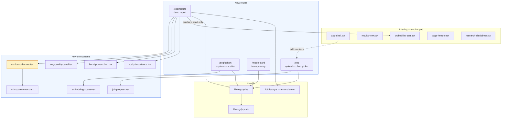

### 6.2 `risk-score-meters` — the component that replaces `ProbabilityBars`

Three **independent** meters, not a distribution. The visual language must make independence obvious:

- Each condition gets its own 0–100 track with its own band colour (Low / Medium / High).
- A caption states plainly that **scores are independent and do not sum to 100%**.
- Each meter carries a **confound badge** when severity is not `low`, linking to `/model-card`.
- Epoch spread (`epoch_score_std`) renders as a whisker — a wide spread means the recording disagreed
  with itself, which matters more than the point value.

```tsx
// components/risk-score-meters.tsx  (sketch — verify Next 16 conventions first)
type ConditionRisk = {
  risk_score: number; risk_band: "Low" | "Medium" | "High";
  label: string; epoch_score_std: number; confound_severity: string;
};

const BAND = {
  Low:    { bar: "bg-emerald-600", chip: "bg-emerald-100 text-emerald-800" },
  Medium: { bar: "bg-amber-500",   chip: "bg-amber-100 text-amber-800" },
  High:   { bar: "bg-red-600",     chip: "bg-red-100 text-red-800" },
} as const;

export function RiskScoreMeters({ conditions }: { conditions: Record<string, ConditionRisk> }) {
  return (
    <div className="space-y-6">
      <p className="rounded-md bg-slate-100 px-3 py-2 text-xs text-slate-600">
        These are <strong>independent</strong> risk scores. They do not sum to 100% — a recording can
        show elevated risk for more than one condition at once.
      </p>
      {Object.entries(conditions).map(([name, c]) => {
        const style = BAND[c.risk_band];
        const flagged = c.confound_severity !== "low";
        return (
          <div key={name}>
            <div className="mb-2 flex items-center justify-between text-sm">
              <span className="font-semibold">{c.label}</span>
              <span className="flex items-center gap-2">
                {flagged && (
                  <a href="/model-card"
                     className="rounded-full bg-amber-100 px-2 py-0.5 text-xs font-semibold text-amber-800">
                    {c.confound_severity}
                  </a>
                )}
                <span className={`rounded-full px-2 py-0.5 text-xs font-semibold ${style.chip}`}>
                  {c.risk_band}
                </span>
                <span className="tabular-nums font-bold">{Math.round(c.risk_score * 100)}</span>
              </span>
            </div>
            <div className="relative h-3 overflow-hidden rounded-full bg-slate-200">
              <div className={`h-full rounded-full ${style.bar}`}
                   style={{ width: `${c.risk_score * 100}%` }} />
            </div>
            <div className="mt-1 text-xs text-slate-500">
              epoch spread ±{Math.round(c.epoch_score_std * 100)} pts
            </div>
          </div>
        );
      })}
    </div>
  );
}
```

### 6.3 `confound-banner` — a render-blocking disclosure

The model card says the MS score is partly an age detector on this cohort. The UI must not let that get
lost. **The results page renders the banner above the scores, and it is not collapsible when any
displayed condition carries `CRITICAL` severity.**

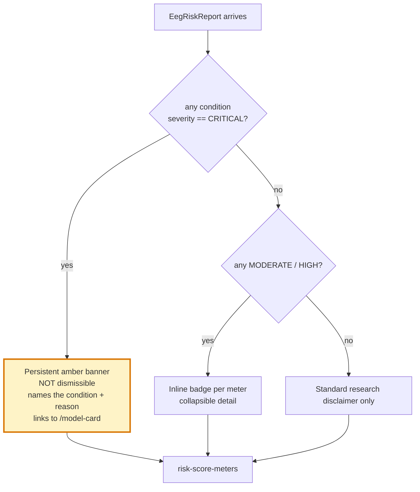

Copy for the critical case, drawn from `model_card.json` rather than hardcoded:

> **Interpret the MS score with caution.** In the training cohort, MS participants were ~33 years
> younger than every other group and were all recorded at one site. Age is recoverable from the
> embedding to within 6.1 years. This score may partly reflect age and recording site rather than
> multiple sclerosis. — *see Model Card*

### 6.4 Results page composition

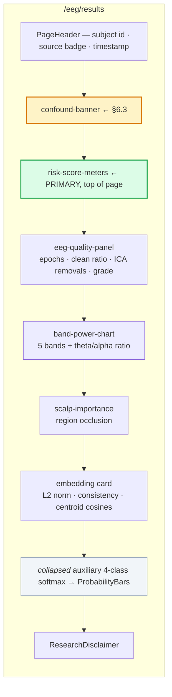

The 4-class softmax is **collapsed by default and labelled auxiliary**. It is the one place
`ProbabilityBars` is correct, because that head genuinely is a distribution — but leading with it would
re-frame the module as a classifier when its deliverable is three independent scores.

### 6.5 Type and history changes

```ts
// lib/eeg-types.ts  (new)
export type RiskCondition = "AD" | "PD" | "MS";
export type RiskBand = "Low" | "Medium" | "High";

export type EegRiskReport = {
  subject_id: string;
  source: "cohort" | "upload";
  generated_at: string;
  risk_scores: Record<`${Lowercase<RiskCondition>}_risk_score`, number>;
  risk_assessment: {
    conditions: Record<RiskCondition, ConditionRisk>;
    highest_risk_condition: RiskCondition;
    scores_are_independent: true;
    interpretation: string;
  };
  optional_four_class_prediction: { predicted_class: string; class_probabilities: Record<string, number> };
  signal_quality: EegSignalQuality;
  band_power_profile: Record<string, number>;
  embedding: EegEmbeddingSummary;
  explainability: EegExplainability;
  confound_disclosure: ConfoundDisclosure;
  clinical_disclaimer: string;
};

export type EegJob = {
  job_id: string;
  status: "queued" | "validating" | "preprocessing" | "inference" | "completed" | "failed";
  progress: number;          // 0-100
  stage_label: string;
  report?: EegRiskReport;
  error?: { code: string; message: string };
};
```

```ts
// lib/types.ts  (modify — additive only)
export type HistoryItem = {
  id: string;
  createdAt: string;
  type: "Voice" | "General" | "EEG";       // ← extended union
  prediction?: Prediction;                  // ← now optional
  eegReport?: EegRiskReport;                // ← new
  features?: SpeechFeatures;
  transcript?: string;
};
```

**Breaking-change warning.** `history/page.tsx` and `insights/page.tsx` both read
`item.prediction.confidence_score` and `item.prediction.predicted_class` unconditionally. Making
`prediction` optional **will break them at runtime** for EEG rows. Both must be updated in the same
change: history renders a per-type result cell, and insights either filters to speech rows or gains an
EEG section. This is called out as a task, not left to be discovered.

---

## 7. Data flow — end to end, new EEG path

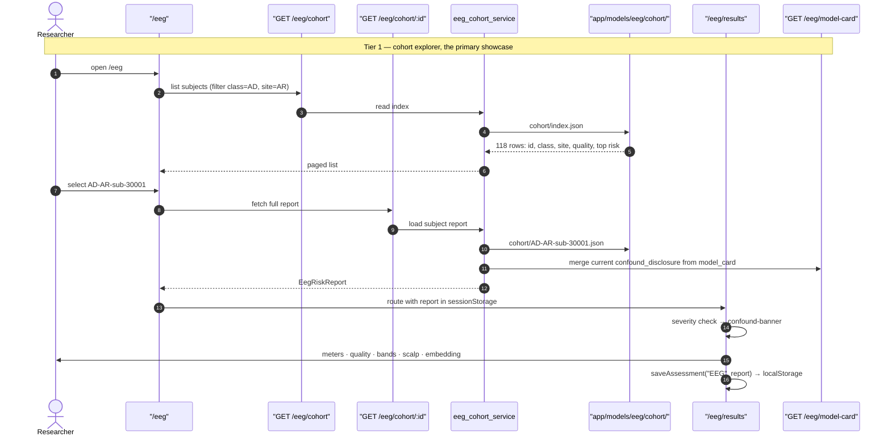

**Why the cohort service re-merges the disclosure at read time** rather than trusting the stored copy:
the confound numbers belong to the *model*, not the subject. If the encoder is retrained and the age
probe improves, every stored report would otherwise keep quoting stale figures. Merging from
`model_card.json` on each read keeps one source of truth.

---

## 8. Implementation phases

```mermaid
gantt
    title EEG module integration
    dateFormat X
    axisFormat %s

    section Phase 1 — Artifacts
    Export bundle from Colab §24            :p1a, 0, 1
    build_eeg_cohort_index.py               :p1b, after p1a, 1
    verify_eeg_bundle.py contract check     :p1c, after p1b, 1

    section Phase 2 — Backend read-only
    eeg_model_loader + schemas              :p2a, after p1c, 1
    eeg_cohort_service                      :p2b, after p2a, 1
    4 GET endpoints + tests                 :p2c, after p2b, 2

    section Phase 3 — Frontend Tier 1
    eeg-api + eeg-types                     :p3a, after p2c, 1
    risk-score-meters + confound-banner     :p3b, after p3a, 2
    /eeg /eeg/results /eeg/cohort           :p3c, after p3b, 2
    /model-card                             :p3d, after p3c, 1

    section Phase 4 — History integration
    Extend HistoryItem union                :p4a, after p3d, 1
    Fix history + insights for optional pred:p4b, after p4a, 1

    section Phase 5 — Backend Tier 2
    eeg_preprocessing MNE pipeline          :p5a, after p4b, 3
    eeg_job_service + inference             :p5b, after p5a, 2
    POST/GET assessment endpoints           :p5c, after p5b, 2

    section Phase 6 — Frontend Tier 2
    Upload UI + job-progress polling        :p6a, after p5c, 2
    Failure-path UX                         :p6b, after p6a, 1
```

| Phase | Deliverable | Independently shippable? |
|---|---|---|
| **1** | Model bundle + cohort index in `app/models/eeg/` | — |
| **2** | Read-only EEG API, fully testable with no PyTorch in the request path | Yes |
| **3** | Cohort explorer + deep report UI — **the demo is live here** | **Yes — this is the showcase** |
| **4** | History/insights handle three assessment types | Yes |
| **5** | Real inference on uploaded EEG | Yes |
| **6** | Upload UX with progress and failure handling | Yes |

**Phase 3 is the milestone that matters.** After it, the module is demonstrable end to end with real
model outputs on real subjects, without any inference infrastructure. Phases 5–6 add capability, not
credibility.

---

## 9. Testing

Mirroring `backend/tests/` conventions (`test_*.py`, FastAPI `TestClient`, assets injected rather than
loaded from disk).

| Test | Asserts |
|---|---|
| `test_eeg_cohort.py::test_index_shape` | Index rows carry id, class, site, quality, top condition |
| `test_eeg_cohort.py::test_report_has_required_blocks` | Every report has `risk_scores`, `confound_disclosure`, `clinical_disclaimer` |
| `test_eeg_cohort.py::test_scores_are_independent` | **`sum(risk_scores) != 1.0`** for at least one subject — guards against a softmax regression |
| `test_eeg_cohort.py::test_disclosure_merged_from_card` | Stale stored disclosure is overwritten by `model_card.json` |
| `test_eeg_model_card.py` | Card exposes per-condition AUC + CI, age/site probes |
| `test_eeg_inference.py::test_torchscript_contract` | `z_eeg` is 256-D, L2 norm 1.0, `availability_flag == 1` |
| `test_eeg_inference.py::test_absent_modality` | No EEG → 256 zeros, flag 0 |
| `test_eeg_jobs.py::test_lifecycle` | queued → preprocessing → completed; TTL purge works |
| `test_eeg_jobs.py::test_quality_rejection` | <20 clean epochs → `failed` with a quality report, not a 500 |
| `test_eeg_upload.py::test_rejects_oversize` | >120 MB → 413 |
| `test_eeg_upload.py::test_rejects_set_without_fdt` | Header-only `.set` → 422 with an actionable message |

The independence test deserves emphasis: the single most likely regression is somebody "fixing" the
risk scores to sum to 1 because a chart looked odd. A test that fails on that is cheap insurance.

---

## 10. Risks

| Risk | Severity | Mitigation |
|---|---|---|
| Confound disclosure gets dropped or collapsed in UI review | **High** | Render-blocking banner for CRITICAL; a UI test asserts presence; copy comes from the model card, not a constant |
| Independent scores rendered as a distribution | **High** | Separate component; backend test asserts non-unit sum; `scores_are_independent: true` in payload |
| Torch + TensorFlow memory pressure in one process | Medium | CPU-only wheels, `set_num_threads(2)`; job contract allows splitting the service without an API change |
| 90 MB uploads through a proxy | Medium | 120 MB cap, chunked read, explicit 413; document proxy `client_max_body_size` |
| Preprocessing time exceeds patience | Medium | Async job + progress; Tier 1 needs no inference at all |
| `HistoryItem.prediction` becoming optional breaks two pages | Medium | Called out in §6.5 as same-change work, with tests |
| Cohort JSON drifts from the deployed model | Low | `verify_eeg_bundle.py` compares `model_card.run_id` against the cohort index; startup log warns on mismatch |
| Next 16 API differences vs. snippets here | Low | §6 caveat; implementer reads `node_modules/next/dist/docs/` first |

---

## 11. What this plan deliberately does not do

- **No changes to the speech pipeline.** `/predictions`, `/voice-assessments` and their UI are untouched.
  The only shared-file edits are the nav list, the `HistoryItem` union, and the two pages that consume it.
- **No fusion engine.** `z_eeg` is exposed via `/eeg/embeddings/{id}` so the group's fusion work can
  consume it, but combining `z_eeg` + `z_img` + `z_bio` is out of scope here.
- **No clinical framing.** Every surface says *EEG risk pattern*, never a diagnosis, matching the
  existing `research-disclaimer.tsx` posture.
- **No auth or persistence layer.** History stays in `localStorage` exactly as the speech path does.
  Server-side storage of EEG recordings would raise data-governance questions this plan does not answer.

---

## 12. File manifest

**New — backend (10 files)**

```
app/api/routes/eeg_assessment.py
app/schemas/eeg_assessment.py
app/services/eeg_model_loader.py
app/services/eeg_cohort_service.py
app/services/eeg_preprocessing.py
app/services/eeg_inference_service.py
app/services/eeg_job_service.py
scripts/build_eeg_cohort_index.py
scripts/verify_eeg_bundle.py
tests/test_eeg_{cohort,model_card,inference,jobs,upload}.py
```

**New — frontend (12 files)**

```
app/eeg/page.tsx · app/eeg/results/page.tsx · app/eeg/cohort/page.tsx · app/model-card/page.tsx
components/risk-score-meters.tsx · confound-banner.tsx · eeg-quality-panel.tsx
components/embedding-scatter.tsx · band-power-chart.tsx · job-progress.tsx · scalp-importance.tsx
lib/eeg-api.ts · lib/eeg-types.ts
```

**Modified (6 files)**

```
backend/app/api/router.py          mount the /eeg router
backend/app/core/exceptions.py     += EegIngestError, EegQualityError, JobNotFoundError
backend/app/core/config.py         += eeg_model_dir, max_eeg_bytes, job_ttl_seconds
backend/requirements.txt           += torch (CPU wheel), mne
frontend/components/app-shell.tsx  += "EEG Assessment" nav item
frontend/lib/types.ts              HistoryItem union + optional prediction
frontend/app/history/page.tsx      handle three types  ← required by the union change
frontend/app/insights/page.tsx     handle optional prediction  ← required by the union change
```

**Unchanged** — every existing route, service, schema and speech component.
