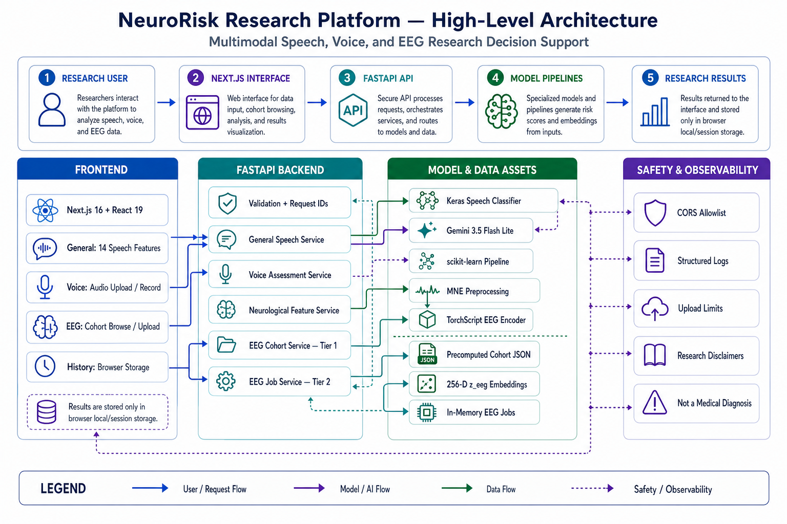

# NeuroRisk Research Platform

**Project ID:** R26-DS-015

NeuroRisk Research Platform is a full-stack research prototype for exploring neurological-risk signals from manually entered speech biomarkers, uploaded voice recordings, and EEG recordings. The browser application is built with Next.js; the API and model-serving layer are built with FastAPI.

> [!IMPORTANT]
> This software is a research decision-support prototype. Its outputs are not medical diagnoses, have not been clinically validated for clinical use, and must not replace evaluation by a qualified clinician.

## Documentation

- [Backend setup, API, models, and tests](backend/README.md)
- [Frontend setup, routes, configuration, and checks](frontend/README.md)
- [Installed EEG model bundle](backend/app/models/eeg/README.md)
- [EEG band-pattern findings](EEG_BAND_PATTERN_FINDINGS.md)

## What the application provides

| Workflow | Input | Processing | Result |
| --- | --- | --- | --- |
| General speech biomarkers | 14 numeric acoustic and timing measurements | Keras classifier plus saved scaler and label encoder | Predicted class, probabilities, confidence, risk level, observations, and recommendations |
| Voice assessment | WAV, MP3, M4A, OGG, or WebM plus age and recording task | Gemini extracts structured speech features; the speech classifier scores them | Transcript, extraction-quality notes, features, and risk result |
| Neurological feature API | A validated 20-field neurological feature payload | Saved scikit-learn runtime pipeline | Predicted class and normalized class probabilities |
| EEG cohort exploration | Precomputed cohort subjects | FastAPI reads the installed model card, reports, embeddings, and cohort statistics | Risk reports, quality, confounds, band context, and embedding views |
| EEG upload assessment | EEGLAB `.set`, optionally paired with `.fdt` | Filter, ICA clean-up, epoching, TorchScript inference, and report generation | Three independent AD/PD/MS risk scores and a 256-D `z_eeg` embedding |

EEG risk scores are independent sigmoid outputs and do not form a probability distribution. More than one condition may be elevated. The optional four-class EEG output is a separate softmax distribution.

## Architecture



The request path runs from the Next.js interface through FastAPI validation and domain services. General speech features use the Keras classifier; voice assessment uses Gemini before speech classification; neurological features use the scikit-learn pipeline; EEG cohort browsing reads precomputed artifacts; and EEG uploads use an in-memory job, MNE preprocessing, and CPU TorchScript inference.

The frontend stores assessment history in the browser's `localStorage` and the current result in `sessionStorage`. The backend does not provide user accounts or persistent assessment storage. EEG upload jobs are held in memory and expire after a configurable time.

## Technology stack

| Layer | Main technologies |
| --- | --- |
| Frontend | Next.js 16.3.1, React 19.2, TypeScript 5.9, Tailwind CSS 4, Radix Slot, Lucide icons |
| Backend | Python, FastAPI, Uvicorn, Pydantic, python-multipart |
| ML and data | TensorFlow/Keras, scikit-learn 1.6.1, XGBoost 3.3, pandas, NumPy, joblib |
| EEG | PyTorch/TorchScript, MNE, precomputed JSON artifacts |
| External service | Google Gemini through `google-genai` for voice feature extraction |
| Quality checks | pytest, FastAPI TestClient, ESLint, TypeScript, Next.js production build |

## Repository layout

```text
R26-DS-015/
|-- backend/
|   |-- app/
|   |   |-- api/routes/       # FastAPI endpoint definitions
|   |   |-- core/             # settings, logging, and exceptions
|   |   |-- models/           # committed speech, neurological, and EEG artifacts
|   |   |-- schemas/          # Pydantic request and response contracts
|   |   |-- services/         # inference and preprocessing logic
|   |   `-- main.py           # FastAPI application
|   |-- scripts/              # smoke test and EEG artifact utilities
|   |-- tests/                # backend pytest suite
|   `-- requirements.txt
|-- frontend/
|   |-- app/                  # Next.js App Router pages
|   |-- components/           # application and UI components
|   |-- lib/                  # API clients, types, history, and helpers
|   |-- package.json
|   `-- package-lock.json
|-- neuro-ai-eeg/             # EEG training/export outputs used by project tooling
`-- README.md
```

## Prerequisites

Install these before starting:

- Git
- Python 3.11 recommended (64-bit). Python 3.12 also runs the test suite; Python 3.11 is the conservative choice for the complete TensorFlow/PyTorch stack.
- Node.js 20.9 or newer; Node.js 22 LTS is recommended.
- npm 10 or newer.
- A Google Gemini API key only if the voice-upload workflow is required.

The full Python installation includes large ML packages. Allow additional installation time and disk space. A GPU is not required; EEG inference is designed for CPU execution.

## Clone-to-run setup

The following steps start the complete application locally. Run backend and frontend commands in separate terminals.

### 1. Clone the repository

```bash
git clone https://github.com/Tanury/R26-DS-015.git
cd R26-DS-015
```

To work on the EEG integration branch explicitly:

```bash
git switch feature/implement-neuro_risk_eeg
```

### 2. Create the backend virtual environment

macOS or Linux:

```bash
cd backend
python3.11 -m venv .venv
source .venv/bin/activate
python -m pip install --upgrade pip
```

Windows PowerShell:

```powershell
cd backend
py -3.11 -m venv .venv
.\.venv\Scripts\Activate.ps1
python -m pip install --upgrade pip
```

If PowerShell blocks activation for the current process, run:

```powershell
Set-ExecutionPolicy -Scope Process -ExecutionPolicy Bypass
.\.venv\Scripts\Activate.ps1
```

### 3. Install backend dependencies

For the complete speech, voice, neurological, and EEG application:

```bash
python -m pip install -r requirements.txt
```

For a guaranteed CPU-only PyTorch wheel, install PyTorch first and then install the remaining requirements. The second command keeps the already-satisfied CPU build:

```bash
python -m pip install torch --index-url https://download.pytorch.org/whl/cpu
python -m pip install -r requirements.txt
```

### 4. Configure the backend

macOS or Linux:

```bash
cp .env.example .env
```

Windows PowerShell:

```powershell
Copy-Item .env.example .env
```

Edit `backend/.env`. The default file is enough for general feature scoring and EEG cohort browsing. Set `GEMINI_API_KEY` to enable voice feature extraction:

```dotenv
APP_NAME=NeuroRisk Research Platform
ENVIRONMENT=development
LOG_LEVEL=INFO
GEMINI_API_KEY=replace-with-your-server-side-api-key
GEMINI_MODEL=gemini-3.5-flash-lite
FRONTEND_ORIGINS=http://localhost:3000,http://127.0.0.1:3000
```

Never commit `backend/.env`; it is ignored by Git. Keep the Gemini key server-side and never expose it through a `NEXT_PUBLIC_*` variable.

### 5. Run the backend

Remain in `backend/` with the virtual environment activated:

```bash
uvicorn app.main:app --reload --host 127.0.0.1 --port 8000
```

Verify it in another terminal:

```bash
curl http://127.0.0.1:8000/health/
```

Expected response:

```json
{"status":"ok"}
```

Interactive API documentation is available at <http://127.0.0.1:8000/docs>.

### 6. Install and configure the frontend

Open a second terminal at the repository root:

```bash
cd frontend
npm ci
```

Create the local frontend environment file.

macOS or Linux:

```bash
cp .env.local.example .env.local
```

Windows PowerShell:

```powershell
Copy-Item .env.local.example .env.local
```

The development value should be:

```dotenv
NEXT_PUBLIC_API_BASE_URL=http://127.0.0.1:8000
```

Values prefixed with `NEXT_PUBLIC_` are included in browser code. Do not put secrets in this file.

### 7. Run the frontend

```bash
npm run dev
```

Open <http://localhost:3000>. Keep both terminal processes running.

### 8. Verify the application

Check these in order:

1. <http://127.0.0.1:8000/health/> returns `{"status":"ok"}`.
2. <http://127.0.0.1:8000/docs> displays the FastAPI routes.
3. <http://localhost:3000> displays the application dashboard.
4. **General** can submit the pre-filled 14-feature example.
5. **EEG** loads the model card and featured cohort subjects.
6. **Voice** is tested only after a valid `GEMINI_API_KEY` has been configured.

## Tests and final verification

### Backend unit and API tests

From `backend/` with the virtual environment active:

```bash
python -m pytest
```

Useful alternatives:

```bash
python -m pytest -q
python -m pytest tests/test_api.py -v
python -m pytest tests/test_eeg_cohort.py -v
python -m pytest -k "voice or prediction" -v
```

### Running-backend smoke test

Start Uvicorn first, then run from `backend/` in another terminal:

```bash
python scripts/test_backend.py
```

This checks the health endpoint and makes a real prediction request against `http://127.0.0.1:8000`.

### Frontend checks

From `frontend/`:

```bash
npm run lint
npm run build
```

There is currently no frontend unit-test runner configured. ESLint plus the production TypeScript/Next.js build are the frontend quality gates.

### Production-mode frontend check

After a successful build:

```bash
npm run start
```

### Recommended final checklist

```text
[ ] backend: python -m pytest
[ ] backend running: python scripts/test_backend.py
[ ] frontend: npm run lint
[ ] frontend: npm run build
[ ] browser: dashboard and General workflow load
[ ] browser: EEG cohort and model card load
[ ] voice workflow: only when GEMINI_API_KEY is configured
```

At the time this documentation was prepared, backend verification completed with **90 passed and 1 skipped** out of 91 tests. The frontend production build completed successfully; ESLint completed with one existing unused-import warning and no errors.

## Configuration reference

### Backend

| Variable | Default | Purpose |
| --- | --- | --- |
| `APP_NAME` | `NeuroRisk Research Platform` | Shared application and FastAPI title |
| `ENVIRONMENT` | `development` | Runtime environment label |
| `LOG_LEVEL` | `INFO` | Application log level |
| `GEMINI_API_KEY` | empty | Enables voice feature extraction |
| `GEMINI_MODEL` | `gemini-3.5-flash-lite` | Gemini model used for audio analysis |
| `FRONTEND_ORIGINS` | localhost and 127.0.0.1 on port 3000 | Comma-separated CORS allowlist |
| `EEG_JOB_TTL_SECONDS` | `1800` | Time an in-memory EEG job remains available |
| `EEG_MAX_ACTIVE_JOBS` | `4` | Maximum number of active EEG jobs |

### Frontend

| Variable | Default in code | Purpose |
| --- | --- | --- |
| `NEXT_PUBLIC_API_BASE_URL` | `http://127.0.0.1:8000` | Base URL used by browser-side API requests |

If the frontend URL changes, add its exact origin to `FRONTEND_ORIGINS`. If the backend URL changes, rebuild/restart the frontend after changing `NEXT_PUBLIC_API_BASE_URL`.

## Main local URLs

| Service | URL |
| --- | --- |
| Frontend | <http://localhost:3000> |
| Backend health | <http://127.0.0.1:8000/health/> |
| Swagger UI | <http://127.0.0.1:8000/docs> |
| OpenAPI JSON | <http://127.0.0.1:8000/openapi.json> |
| ReDoc | <http://127.0.0.1:8000/redoc> |

## Common problems

### The frontend says the API is unreachable

- Confirm Uvicorn is running on port 8000.
- Confirm `NEXT_PUBLIC_API_BASE_URL` has no route suffix such as `/docs`.
- Confirm the frontend origin is present in `FRONTEND_ORIGINS`.
- Restart the frontend after changing `.env.local`.

### Voice assessment returns 503

Set a valid `GEMINI_API_KEY` in `backend/.env` and restart Uvicorn. General feature scoring and EEG cohort browsing do not need Gemini.

### EEG cohort works but uploads return 503

The deployment does not have PyTorch or the TorchScript graph available. Install the CPU PyTorch wheel and confirm the committed files under `backend/app/models/eeg/` are present. The `/eeg/model-card` response reports `inference_available` explicitly.

### A `.set` upload reports a missing `.fdt`

Some EEGLAB files store metadata in `.set` and signal data in a separate `.fdt`. Upload both matching files together. Self-contained `.set` files need no companion.

### Import errors when starting FastAPI

Run Uvicorn from the `backend/` directory with the backend virtual environment activated. Use `python -m pip install -r requirements.txt` to ensure installation targets that same interpreter.

### Port 3000 or 8000 is already in use

Start the service on another port and update both `NEXT_PUBLIC_API_BASE_URL` and `FRONTEND_ORIGINS` so they remain consistent.

## Responsible use and data handling

- Do not use the output as a diagnosis or treatment recommendation.
- Do not commit API keys, patient recordings, protected health information, or local environment files.
- Review consent, retention, access-control, and de-identification requirements before using real participant data.
- Browser history is local to the current browser profile; it is not a secure clinical record.
- Uploaded EEG data is processed through an in-memory job flow, but this prototype is not a compliance-certified medical platform.
- Voice audio is sent to the configured Gemini service. Confirm that this is permitted by the applicable consent and data-governance rules before using real recordings.
